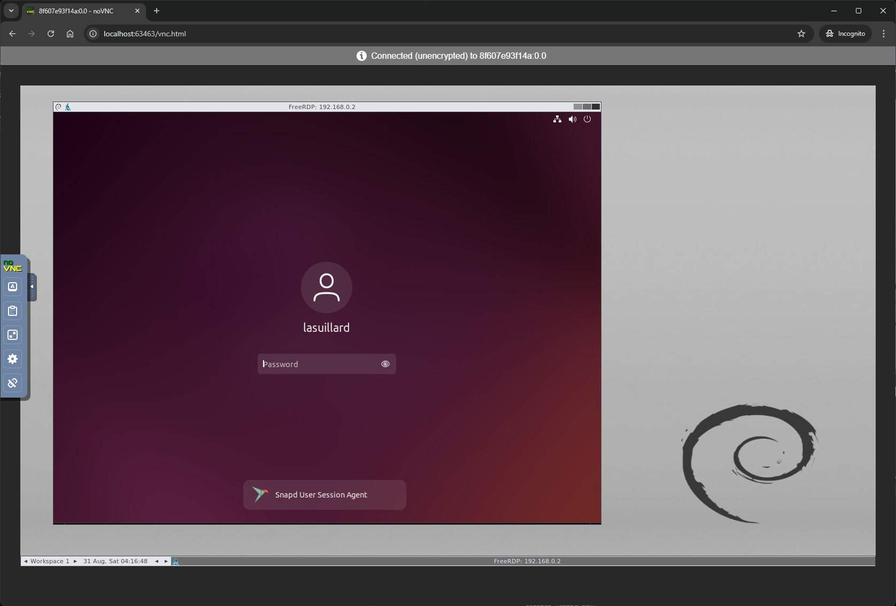

# freerdp-novnc

[](https://opensource.org/licenses/MIT)
[](https://results.pre-commit.ci/latest/github/lasuillard/freerdp-novnc/main)


Docker image for FreeRDP client with noVNC.



## ✨ Features

I built this image to provide access to remote server through noVNC for simple use cases. It is generally recommend to use existing RDP clients for more advanced use cases.

- Configure access to remote server through FreeRDP over web UI (noVNC)

## 📔 Usage

You can try this image with Docker Compose by simply checking it out and running `docker compose up --build`. For more details, please check `docker-compose.yaml` file.

To pull and run image from [Docker Hub](https://hub.docker.com/r/lasuillard/freerdp-novnc), as follow:

```bash
$ docker run --rm \
    -p 127.0.0.1:8080:8080 \
    -e DISPLAY_WIDTH=1024 \
    -e DISPLAY_HEIGHT=768 \
    -e RDP_USERNAME=username \
    -e RDP_PASSWORD=password \
    -e RDP_HOST=host \
    lasuillard/freerdp-novnc:main
```

Then open browser and go to http://localhost:8080 to access noVNC.

Supported environment variables:

- `DISPLAY_WIDTH`, `DISPLAY_HEIGHT`: noVNC display geometry. Each defaults to `1024` and `768`.

- `RDP_HOST`: Remote RDP host. **Required**.

- `RDP_PORT`: Remote RDP port. Defaults to `3389`.

- `RDP_USERNAME`, `RDP_PASSWORD`: Remote RDP login credentials. **Required**.

- `RDP_ARGUMENTS`: Arguments to pass to FreeRDP CLI (`freerdp`). Defaults to `/cert:ignore /dynamic-resolution`.
